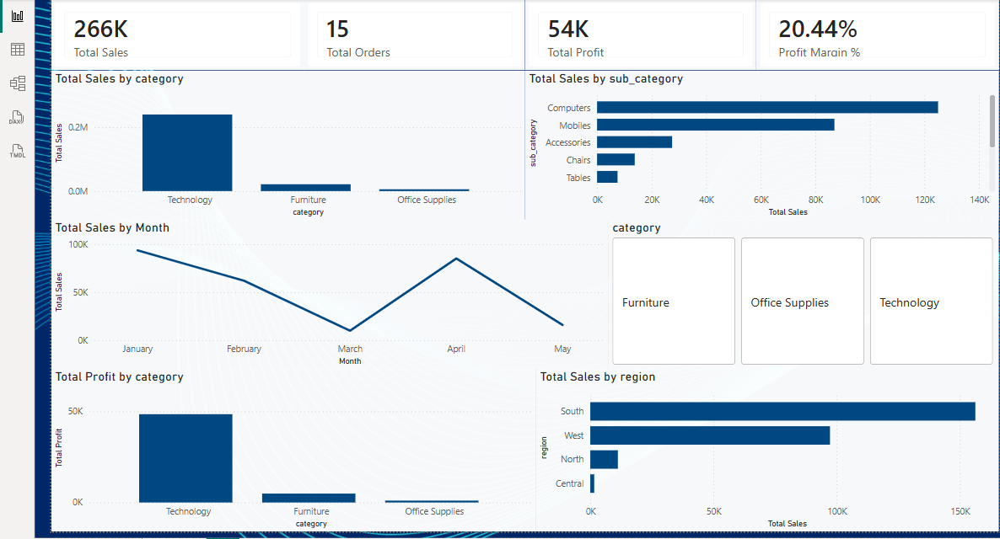

# sales-performance-analysis-powerbi
End-to-end Sales Performance Analysis using SQL and Power BI
# Sales Performance Analysis using SQL & Power BI

## 📌 Project Overview
This project focuses on analyzing sales performance data to understand revenue trends, profitability, customer demand, and regional performance. The goal is to convert raw sales data into actionable business insights using SQL and Power BI.

## 🛠 Tools & Technologies
- SQL (MySQL) – data cleaning, aggregation, KPI calculation
- Power BI – data modeling, DAX measures, interactive dashboard
- DAX – calculated measures (Sales, Profit, Profit Margin)
- CSV dataset

## 📊 KPIs Created
- Total Sales
- Total Profit
- Total Orders
- Profit Margin %

## 📈 Dashboard Analysis
- Sales & profit performance by **Category and Sub-Category**
- Monthly sales trend analysis
- Region-wise sales comparison
- Interactive slicer for category filtering
- KPI cards for quick business overview

## 🔍 Key Business Insights
- Technology category generates the highest sales and profit
- Certain categories show lower profit margins despite high sales
- Sales fluctuate month-to-month, indicating seasonality
- Regional sales performance varies significantly

## 📷 Dashboard Preview

## 🎯 Business Value
This dashboard helps stakeholders:
- Track overall business performance
- Identify profitable and underperforming categories
- Support data-driven decisions in pricing and inventory planning
